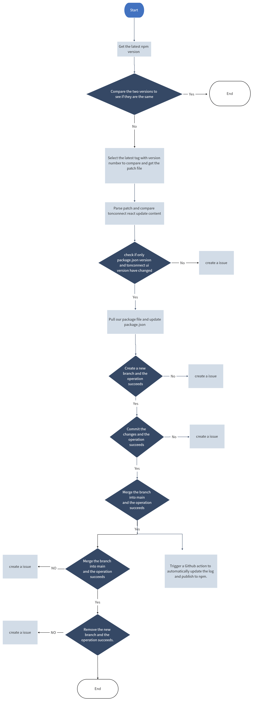

# TON Connect UI Vue

TonConnect UI Vue is a Vue UI kit for TonConnect SDK. Use it to connect your app to TON wallets via TonConnect protocol in Vue apps.

If you don't use Vue for your app, take a look at [TonConnect UI](https://github.com/ton-connect/sdk/tree/main/packages/ui) and [TonConnect UI React](https://github.com/ton-connect/sdk/tree/main/packages/ui-react).

If you want to use TonConnect on the server side, you should use the [TonConnect SDK](https://github.com/ton-connect/sdk/tree/main/packages/sdk).

You can find more details and the protocol specification in the [docs](https://docs.ton.org/develop/dapps/ton-connect/overview).

---

# Getting started

[Latest API documentation](https://ton-connect.github.io/sdk/modules/_tonconnect_ui-vue.html)

# Getting started

## Installation with npm
`npm i @townsquarelabs/ui-vue`
## Installation with npm
`yarn add @townsquarelabs/ui-vue`

# Sync with Official Releases
This [OFFICIAL_SYNC.md](./OFFICIAL_SYNC.md) file describes how we synchronize with the official.

# Usage

## Add TonConnectUIProvider
Add TonConnectUIProvider to the root of the app. You can specify UI options using props.
// todo
<!-- [See all available options](https://ton-connect.github.io/sdk/types/_tonconnect_ui_react.TonConnectUIProviderProps.html) -->

All TonConnect UI hooks calls and `<TonConnectButton />` component must be placed inside `<TonConnectUIProvider>`.

```vue
<template>
  <TonConnectUIProvider :options="options">
    <!-- Your app -->
  </TonConnectUIProvider>
</template>

<script>
import { TonConnectUIProvider } from '@townsquarelabs/ui-vue';

export default {
  components: {
    TonConnectUIProvider
  },
  setup(){
    const options = {
      manifestUrl:"https://<YOUR_APP_URL>/tonconnect-manifest.json",
    };
    return {
      options
    }
  }
}
</script>
```

## Add TonConnect Button
TonConnect Button is universal UI component for initializing connection. After wallet is connected it transforms to a wallet menu.
It is recommended to place it in the top right corner of your app.

```vue
<template>
  <header>
    <span>My App with Vue UI</span>
    <TonConnectButton/>
  </header>
</template>

<script>
import { TonConnectButton } from '@townsquarelabs/ui-vue';

export default {
  components: {
    TonConnectButton
  }
}
</script>
```

You can add `class` and `:style` props to the button as well. Note that you cannot pass child to the TonConnectButton. 
`<TonConnectButton class="my-button-class" :style="{ float: 'right' }"/>`


## Use TonConnect UI hooks

### useTonAddress
Use it to get user's current ton wallet address. Pass boolean parameter isUserFriendly to choose format of the address. If wallet is not connected hook will return empty string.

```vue
<template>
  <div v-if="address">
    <span>User-friendly address: {{ userFriendlyAddress }}</span>
    <span>Raw address: {{ rawAddress }}</span>
  </div>
</template>

<script>
import { useTonAddress } from '@townsquarelabs/ui-vue';

export default {
  setup() {
    const userFriendlyAddress = useTonAddress();
    const rawAddress = useTonAddress(false);

    return {
      userFriendlyAddress,
      rawAddress
    }
  }
}
</script>
```

### useTonWallet
Use it to get user's current ton wallet. If wallet is not connected hook will return null.

See all wallet's properties
// todo
<!-- [Wallet interface](https://ton-connect.github.io/sdk/interfaces/_tonconnect_sdk.Wallet.html) -->
<!-- [WalletInfo interface](https://ton-connect.github.io/sdk/types/_tonconnect_sdk.WalletInfo.html) -->

```vue
<template>
  <div v-if="wallet">
    <span>Connected wallet: {{ wallet.name }}</span>
    <span>Device: {{ wallet.device.appName }}</span>
  </div>
</template>

<script>
import { useTonWallet } from '@townsquarelabs/ui-vue';

export default {
  setup() {
    const wallet = useTonWallet();

    return {
      wallet
    }
  }

}
</script>
```

### useTonConnectModal

Use this hook to access the functions for opening and closing the modal window. The hook returns an object with the current modal state and methods to open and close the modal.

```vue
<template>
  <div>
    <div>Modal state: {{ state?.status }}</div>
    <button @click="open">Open modal</button>
    <button @click="close">Close modal</button>
  </div>
</template>

<script>
import { useTonConnectModal } from '@townsquarelabs/ui-vue';

export default {
  setup() {
    const { state, open, close } = useTonConnectModal();
    return { state, open, close };
  }
};
</script>
```

### useTonConnectUI
Use it to get access to the `TonConnectUI` instance and UI options updating function.

[See more about TonConnectUI instance methods](https://github.com/ton-connect/sdk/tree/main/packages/ui#send-transaction)

[See more about setOptions function](https://github.com/ton-connect/sdk/tree/main/packages/ui#change-options-if-needed)


```vue
<template>
  <div>
    <button @click="sendTransaction">Send transaction</button>
    <div>
      <label>language</label>
      <select @change="onLanguageChange($event.target.value)">
        <option value="en">en</option>
        <option value="ru">ru</option>
        <option value="zh">zh</option>
      </select>
    </div>
  </div>
</template>

<script>
import { Locales, useTonConnectUI } from '@townsquarelabs/ui-vue';

export default {
  name: 'Settings',
  setup() {
    const [tonConnectUI, setOptions] = useTonConnectUI();

    const onLanguageChange = (lang) => {
      setOptions({ language: lang as Locales });
    };

    const myTransaction = {
      validUntil: Math.floor(Date.now() / 1000) + 60, // 60 sec
      messages: [
        {
          address: "EQBBJBB3HagsujBqVfqeDUPJ0kXjgTPLWPFFffuNXNiJL0aA",
          amount: "20000000",
          // stateInit: "base64bocblahblahblah==" // just for instance. Replace with your transaction initState or remove
        },
        {
          address: "EQDmnxDMhId6v1Ofg_h5KR5coWlFG6e86Ro3pc7Tq4CA0-Jn",
          amount: "60000000",
          // payload: "base64bocblahblahblah==" // just for instance. Replace with your transaction payload or remove
        }
      ]
    }

    const sendTransaction = () => {
      tonConnectUI.sendTransaction(myTransaction);
    };

    return { onLanguageChange, sendTransaction };
  }
};
</script>
```

### useIsConnectionRestored
Indicates current status of the connection restoring process.
You can use it to detect when connection restoring process if finished.

```vue
<template>
  <div>
    <div v-if="!connectionRestored">Please wait...</div>
    <MainPage v-else />
  </div>
</template>

<script>
import { useIsConnectionRestored } from '@townsquarelabs/ui-vue';

export default {
  name: 'EntrypointPage',
  setup() {
    const connectionRestored = useIsConnectionRestored();
    return { connectionRestored };
  }
};
</script>
```

## Add connect request parameters (ton_proof)
Use `tonConnectUI.setConnectRequestParameters` function to pass your connect request parameters.

This function takes one parameter:

Set state to 'loading' while you are waiting for the response from your backend. If user opens connect wallet modal at this moment, he will see a loader.
```ts
import { ref } from 'vue';
import { useTonConnectUI } from '@townsquarelabs/ui-vue';

const tonConnectUI = useTonConnectUI();

tonConnectUI.setConnectRequestParameters({
    state: 'loading'
});
```

or

Set state to 'ready' and define `tonProof` value. Passed parameter will be applied to the connect request (QR and universal link).
```ts
import { ref } from 'vue';
import { useTonConnectUI } from '@townsquarelabs/ui-vue';

const tonConnectUI = useTonConnectUI();

tonConnectUI.setConnectRequestParameters({
    state: 'ready',
    value: {
        tonProof: '<your-proof-payload>'
    }
});
```

or

Remove loader if it was enabled via `state: 'loading'` (e.g. you received an error instead of a response from your backend). Connect request will be created without any additional parameters.
```ts
import { ref } from 'vue';
import { useTonConnectUI } from '@townsquarelabs/ui-vue';

const tonConnectUI = useTonConnectUI();

tonConnectUI.setConnectRequestParameters(null);
```


You can call `tonConnectUI.setConnectRequestParameters` multiple times if your tonProof payload has bounded lifetime (e.g. you can refresh connect request parameters every 10 minutes).


```ts
import { ref } from 'vue';
import { useTonConnectUI } from '@townsquarelabs/ui-vue';

const tonConnectUI = useTonConnectUI();

// enable ui loader
tonConnectUI.setConnectRequestParameters({ state: 'loading' });

// fetch you tonProofPayload from the backend
const tonProofPayload: string | null = await fetchTonProofPayloadFromBackend();

if (!tonProofPayload) {
    // remove loader, connect request will be without any additional parameters
    tonConnectUI.setConnectRequestParameters(null);
} else {
    // add tonProof to the connect request
    tonConnectUI.setConnectRequestParameters({
        state: "ready",
        value: { tonProof: tonProofPayload }
    });
}

```


You can find `ton_proof` result in the `wallet` object when wallet will be connected:

```ts
import { ref, onMounted } from 'vue';
import { useTonConnectUI } from '@townsquarelabs/ui-vue';

const tonConnectUI = useTonConnectUI();

onMounted(() =>
    tonConnectUI.onStatusChange(wallet => {
        if (wallet.connectItems?.tonProof && 'proof' in wallet.connectItems.tonProof) {
            checkProofInYourBackend(wallet.connectItems.tonProof.proof, wallet.account);
        }
}));
```

# Troubleshooting

## Animations not working

If you are experiencing issues with animations not working in your environment, it might be due to a lack of support for the Web Animations API. To resolve this issue, you can use the `web-animations-js` polyfill.

### Using npm

To install the polyfill, run the following command:

```shell
npm install web-animations-js
```

Then, import the polyfill in your project:

```typescript
import 'web-animations-js';
```

### Using CDN

Alternatively, you can include the polyfill via CDN by adding the following script tag to your HTML:

```html
<script src="https://www.unpkg.com/web-animations-js@latest/web-animations.min.js"></script>
```

Both methods will provide a fallback implementation of the Web Animations API and should resolve the animation issues you are facing.

# Sync with Official Releases

We are committed to providing our users with a reliable and continuously optimized Kit, so we will keep in close sync with the official release, and whenever a new official version is released, we will quickly update it to ensure that our Kit will always include the latest features, fixes, and improvements. Additionally, we conduct regular compatibility tests and performance optimizations based on the official release cadence to ensure you get the best experience possible. Whether it's the introduction of new features or security enhancements, you can rest assured that you can rely on us to stay consistent and on the cutting edge with the official release.

## process description

1. get the latest npm version to compare

2. if inconsistent, select the latest tag with version number to compare and get the patch file
  a. get all tags
  b. select the tags to compare
  c. get the patch file

3. parse patch and compare tonconnect react update content

4. if only package.json version and tonconnect ui version have changed

5. pull our package file and update these fields
  a. pull the latest code
  b. update package.json

6. create a new branch and commit the changes

7. merge the branch into main

8. trigger github action to automatically update log and publish to npm

9. after successful merge, remove the created branch

10. if the patch contains more than just version updates, create an issue to be notified
  a. if the patch contains other significant changes, create an issue on github to be notified about the updates

11. if any request fails after step 3, create an issue, making sure there is only one issue per problem


 
